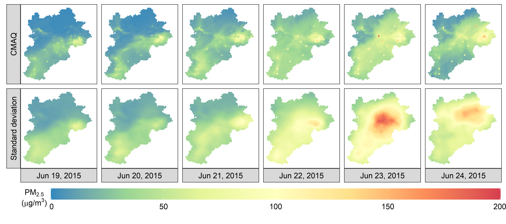
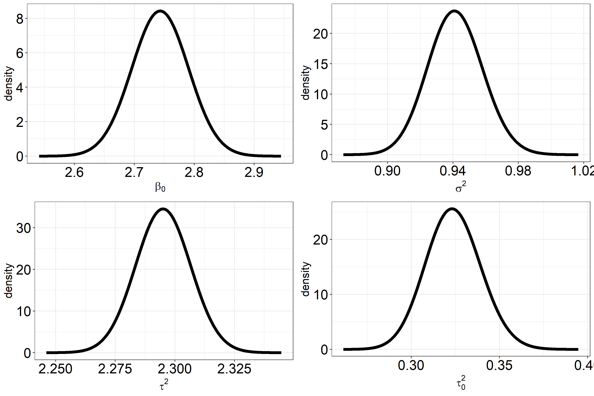
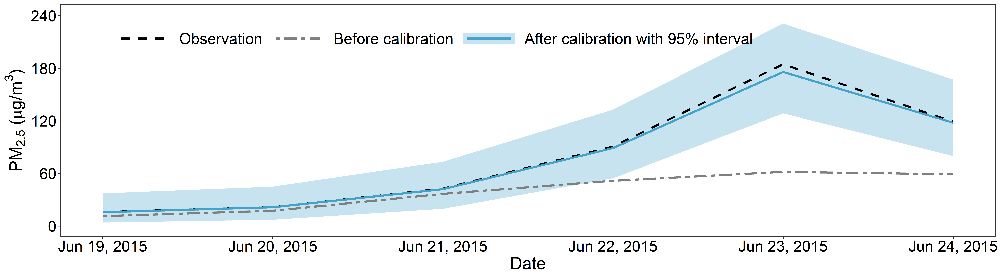
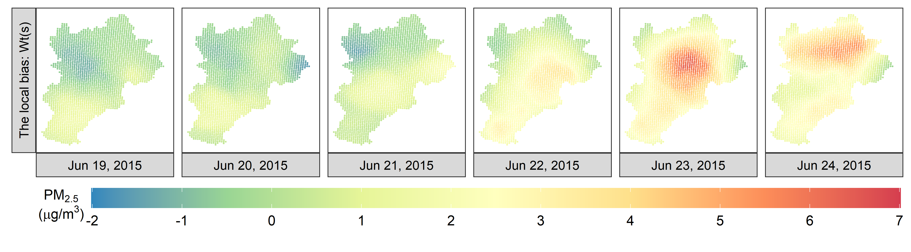
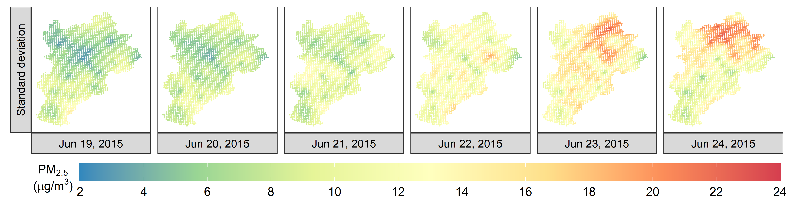

# HDCM
Data and Codes for the paper: “Efficient and Effective Calibration of Numerical Model Outputs Using Hierarchical Dynamic Models” by Y. Chen, X. Chang, B. Zhang, and H. Huang. 

## Data
Daily PM2.5 concentrations of China's Beijing-Tianjin-Hebei (BTH) region from the CMAQ system and national monitoring stations. The datasets contain two seasons of 2015 described in Section 2 of the manuscript. Besides PM2.5 concentrations, these datasets contain many necessary covariates, such as longitude, latitude, air pressure, temperature, dew point, cumulative wind power, and other variables.

There are 3 .RData files. 
-	CMAQ_PM25.RData contains numerical model outputs;
-	SiteData.RData is for 68 monitoring stations;
-	GeoMap.RData from other data sources. 

We have developed an R package - stBase for this work. Using our stBase package, these data files can be loaded by using the ``data'' function. 

## Codes
There are two parts to our codes: 
1. Our two algorithms, the VB and the EnKs, were written into the stBase package in the R statistical environment;
2. A project entitled ``HDCMc'' in the Rstudio environment was built to reproduce all the results (e.g., figures and tables) in this work. 

```
# Require core package
1. R >= 4.1.1
2. Rcpp >= 1.0.7
3. gpuR >= 2.0.3
```
One can first install most of the required dependent packages using the following command:
```
source("./R/PSTVB_Packages.R")
```
On the other hand, the stBase package depends on the gpuR package that allows our codes to run on the GPU platform and hence further speeds up the calibration procedure. The source codes and its installation instructions for gpuR can now be found in a GitHub repository https://github.com/cdeterman/gpuR One can also download the gpuR package here: https://cran.r-project.org/src/contrib/Archive/gpuR/

The stBase package can be installed by the following command:
```
 install.packages("./package/stBase_1.0.zip", repos = NULL, type = "win.binary")
```


```
################################ An example for fitting HDCM ############################
rm(list=ls())
source("./R/PSTVB_Packages.R")
data("SiteData", package = "stBase")
data("GeoMap", package = "stBase")
##########################################################################################
#              1. Create triangulated mesh of the BTH region
##########################################################################################
grid <- CreateGrid(Site, max.edge = c(.35, .65), offset = c(1e-1, 0.5),
                   cutoff = .05, col = "black", size = 1)
grid$plot.grid
```

```

##########################################################################################
#                       2. Mapping matrix: H
##########################################################################################
Data_Str <- CreateHmatrix(grid, method = c("indicator"), #indicator, INLA, Wendland
                           site = Site, factor = 1, 
                           cs = .15,  distance = F,
                           distance.method = "geodetic:km" #geodetic:1000km
                          )
##########################################################################################
#                          3. Data for modeling 
##########################################################################################
YearMonth <- c(201511, 201512, 201601)

# do transformation for some variables 
Model_Base_Table_Update[, c("CMAQ_PM25_30", "REAL_RAIN", "ALTITUDE", "REAL_PRES")]=
  sqrt(Model_Base_Table_Update[, c("CMAQ_PM25_30", "REAL_RAIN", "ALTITUDE", "REAL_PRES")])
# construct datasets  
Yts_Xts <- ParYtsXts(Model_Base_Table_Update, 
                     include = list(YearMonth = YearMonth),
		     X = c("CMAQ_PM25_30", "REAL_LON_WIND", "REAL_TEMP",
			   "REAL_PRES", "REAL_DEWP", "REAL_LAT_WIND"))
##########################################################################################
#-----------------------------------------------------------------------------------------
#                         4. Model setting
##########################################################################################
{
  # Yts_Xts$X_ts[2,,] <- sqrt(Yts_Xts$X_ts[2,,])
  p1 = dim(Yts_Xts$X_ts)[1]
  p2 = 0
  #---------------------------------------------------------------------
  #                           4.1 Prior
  #---------------------------------------------------------------------
  prior <- list(
	      beta = list(betaX.mu = rep(0, p1),
			betaX.Sigma2 = 1e5*diag(1, p1, p1),
			betaZ.mu = rep(0, p2),
			betaZ.Sigma2 = 1e5*diag(1, p2, p2))
	    , alpha = list(mu = c(0), Sigma2 = 1e5)
	    , Obs.tau2 = list(a = 2, b = 1)
	    , Proc.tau2 = list(a = 2, b = 1)
	    , Proc0.tau2 = list(a = 2, b = 1)
	    , theta1 = list(mu = 1e-2, Sigma2 =  1e5)
	 )
  #---------------------------------------------------------------------
  #                        4.2 initialize  parameters
  #---------------------------------------------------------------------
  para <- list(
	      beta = list(E_betaX = c(2.5, 0.5, rep(0, p1-2)), 
			E_betaZ = rep(0, p2))
	    , alpha = list(E_alpha = c(1))
	    , theta1 = list(E_theta1 = 1e-2, Sigma2 = 1)
	    , k = list(E_k = 1, a = 1e-1, b = 2e1)
	    , k0 = list(E_k0 = 1, a = 1e-1, b = 2e1)
	    , theta2 = list(E_theta2 = 0.1, a = 1e-2, b = 0.1) 
	    , Obs.tau2 = list(E_tau2 = 1, a = 2, b = 1)
	    , Proc.tau2 = list(E_tau2 = 1, a = 2, b = 1)
	    , Proc0.tau2 = list(E_tau2 = 1, a = 2, b = 1)
	  )
}
##########################################################################################
#                           Model fitting and prediction
##########################################################################################
ds <- min(Data_Str$BAUs.Dist[row(Data_Str$BAUs.Dist)!= col(Data_Str$BAUs.Dist)])
library(profvis)
CV_T_Dist_W <- spMixCall(Tab = "HDCM_W", Site = Site, Yts_Xts = Yts_Xts, 
            		 Data_Str = Data_Str, prior = prior, para = para, 
                         Total = FALSE, Database = FALSE, parallel = TRUE, 
			 verbose.VB = TRUE, verbose = TRUE, Object = "CITY",
            		 cs = 0.4, ct = 1, tol.vb = 1e-5, tol.real = 1e-3, 
			 itMax = 5e1, Obj.Seq = c(1:13))
```
Based on the stBase package, we perform a space-time calibration of the the Community Multiscale Air Quality (CMAQ) system outputs for the entire BTH region using the proposed hierarchical dynamic calibration model (i.e., HDCM). The following figure displays the CMAQ outputs before and after calibration using the HDCM from June 1, 2015 and August 31, 2015:

In each of the 13 cities, the average PM2.5 concentration of all the stations in the city is marked using a solid square. The smoother the transition from the cities to the rural areas, the better the overall calibration results. It is evident that the before-calibration CMAQ outputs do not match well with most of the pollution data. After calibration, the transition from the cities to their surrounding areas becomes much smoother.

Based on the funtion spMixCall(), we obatin the posterior distribution of the HDCM parameters such as $`\beta_0`$ for the intercept (i.e., normal distribution), $`\sigma^2`$ for the variance of the error of data model (i.e., inverse Gamma distribution),  $`\tau^2`$ and  $`\tau_0^2`$ are two scale parameters of the dynamic process model along with its initial state  (i.e., Gamma distributions), see the following figure:  


We also show a calibration result for PM2.5 concentrations at Beijing:


Our calibration model recoveries the local addtive bias pattern for the pollution map of the BTH between June 1, 2015 and August 31, 2015, see the following figure:


In addition, we also provide posterior standard deviation of the calibrating map during this period:


Obviously, the closer to the location of the observation data, the lower the standard deviation.

